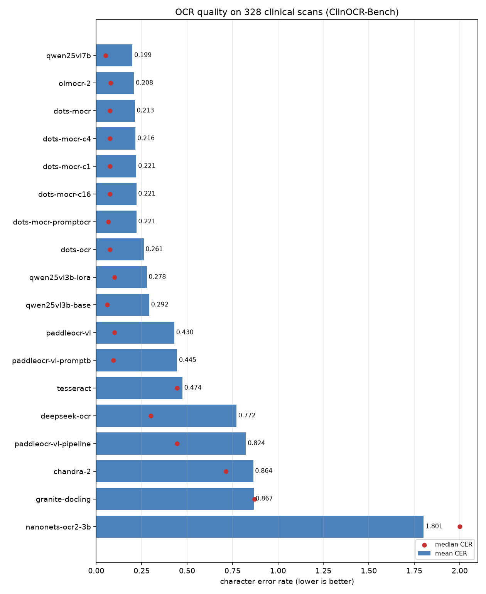
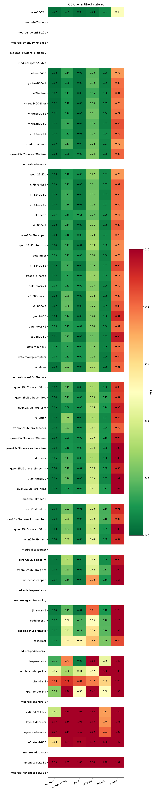
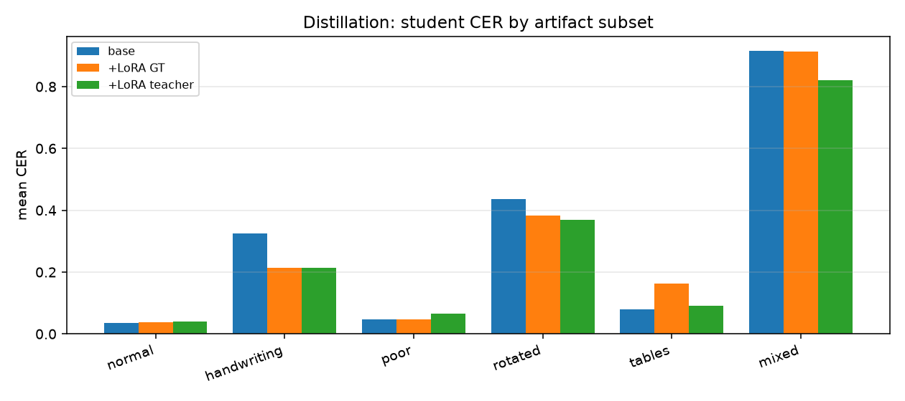

# Clinical OCR model bake-off — overnight results

Open-weights OCR / document-VLM evaluation on **real-artifact clinical scanned documents**, plus a routing study and a distillation experiment. All data is public or synthetic (no PHI).

_Generated 2026-09-14T07:14Z from `make_report.py`; 19 scored models, 9 experiment runs._

## TL;DR

- **Best accuracy: `qwen25vl7b`** (mean CER 0.199, median 0.051).
- **Best value: `dots-mocr` (3B, MIT)** — CER 0.213 vs olmOCR-2's 0.208 at 1.4x the throughput.
- **Incumbent Tesseract**: mean CER 0.474, median 0.444 — the gap is worst on the degraded artifacts that dominate inbound faxes.
- **Distillation**: LoRA on synthetic degraded docs: overall CER 0.292 -> 0.278 (+0.014); handwriting +0.110; rotated +0.053
- **Teacher labels**: olmOCR-2 output matches exact ground truth at CER 0.060 (median 0.0007) on 200 synthetic degraded clinical docs — cheap to mint training labels for unlabeled scans.

## 1. Setup

**Data.** [`ClinOCR-Bench`](https://huggingface.co/datasets/Daniele0025/ClinOCR-Bench) (MIT): 328 eval documents across six artifact subsets — normal, handwriting, poor-quality, rotated, tables, mixed — built from 16 clinical templates (referral faxes, pathology reports, lab panels, discharge summaries) with real-world degradation and human-audited ground truth.

**Synthetic corpus for training.** 800 generated clinical documents with exact labels (263 handwriting-font), rendered and then degraded (rotation, perspective, blur, noise, low-DPI, JPEG, speckle, fold lines, vignette). Held-out evaluation stays on ClinOCR-Bench, which uses a different construction pipeline.

**Metric.** Character error rate (CER) after normalising markup and whitespace; plus field-level recall of dates, MRNs, accession codes, decimals and phone numbers (section 3).

**Hardware.** 2× RTX 4090 24 GB; vLLM v0.27.1 for served models; one model per GPU.

**Sample documents** (normal / handwriting / rotated / mixed):

| normal | handwriting | rotated | mixed |
|---|---|---|---|
|  |  |  |  |

## 2. Leaderboard

| model | params | license | mean CER | median CER | pages/s | normal | handwriting | poor | rotated | tables | mixed |
|---|---|---|---|---|---|---|---|---|---|---|---|
| qwen25vl7b | 7B | Apache-2.0 | 0.1994 | 0.0513 | 0.54 | 0.026 | 0.103 | 0.076 | 0.265 | 0.071 | 0.732 |
| olmocr-2 | 8B | Apache-2.0 | 0.2076 | 0.0796 | 0.48 | 0.067 | 0.103 | 0.112 | 0.196 | 0.081 | 0.767 |
| dots-mocr | 3B | MIT | 0.2126 | 0.0747 | 0.67 | 0.085 | 0.126 | 0.085 | 0.241 | 0.058 | 0.759 |
| dots-mocr-c4 | ? | ? | 0.2161 | 0.0746 | 0.53 | 0.084 | 0.116 | 0.086 | 0.246 | 0.058 | 0.788 |
| dots-mocr-c1 | ? | ? | 0.2209 | 0.0754 | 0.26 | 0.085 | 0.120 | 0.091 | 0.244 | 0.059 | 0.811 |
| dots-mocr-c16 | ? | ? | 0.2210 | 0.0747 | 0.77 | 0.086 | 0.124 | 0.086 | 0.246 | 0.058 | 0.810 |
| dots-mocr-promptocr | ? | ? | 0.2213 | 0.0675 | 0.65 | 0.082 | 0.119 | 0.088 | 0.244 | 0.045 | 0.837 |
| dots-ocr | 3B | MIT | 0.2613 | 0.0761 | 0.61 | 0.051 | 0.165 | 0.083 | 0.314 | 0.061 | 0.999 |
| qwen25vl3b-lora | 3B + LoRA (37M) | Apache-2.0 | 0.2783 | 0.1003 | 0.10 | 0.039 | 0.215 | 0.046 | 0.383 | 0.164 | 0.914 |
| qwen25vl3b-base | 3B | Apache-2.0 | 0.2919 | 0.0616 | 0.18 | 0.036 | 0.325 | 0.047 | 0.436 | 0.080 | 0.916 |
| paddleocr-vl | 0.9B | Apache-2.0 | 0.4298 | 0.1005 | 1.70 | 0.071 | 0.502 | 0.164 | 0.502 | 0.183 | 1.278 |
| paddleocr-vl-promptb | ? | ? | 0.4453 | 0.0949 | 1.69 | 0.066 | 0.418 | 0.167 | 0.588 | 0.184 | 1.385 |
| tesseract | n/a | Apache-2.0 | 0.4744 | 0.4440 | 1.41 | 0.081 | 0.533 | 0.531 | 0.665 | 0.237 | 0.853 |
| deepseek-ocr | 3B MoE | MIT | 0.7717 | 0.3007 | 0.88 | 0.153 | 0.765 | 0.053 | 1.835 | 0.447 | 1.477 |
| paddleocr-vl-pipeline | 0.9B + PP-DocLayoutV2 | Apache-2.0 | 0.8235 | 0.4455 | 0.27 | 0.453 | 0.304 | 0.409 | 0.521 | 2.000 | 1.326 |
| chandra-2 | 5B | OpenRAIL-M (research/personal/<$2M only) | 0.8641 | 0.7134 | 0.40 | 0.826 | 0.897 | 0.839 | 0.770 | 0.625 | 1.289 |
| granite-docling | 0.26B | Apache-2.0 | 0.8665 | 0.8710 | 1.11 | 0.261 | 1.460 | 0.503 | 1.422 | 0.503 | 1.081 |
| nanonets-ocr2-3b | 3B | Apache-2.0 | 1.8010 | 2.0000 | 0.21 | 1.786 | 1.550 | 1.850 | 1.744 | 1.976 | 1.916 |
| teacher-labels | ? | ? | nan | nan | 0.85 | nan | nan | nan | nan | nan | nan |



## 3. Where models fail



## 4. Throughput & cost

| model | pages/s (1 GPU, c=8) | pages/day (1 GPU) | electricity/day | Azure Layout/day | saving |
|---|---|---|---|---|---|
| paddleocr-vl | 1.70 | 146,534 | $1.62 | $1,465 | 905x |
| paddleocr-vl-promptb | 1.69 | 146,189 | $1.62 | $1,462 | 902x |
| granite-docling | 1.11 | 96,336 | $1.62 | $963 | 595x |
| deepseek-ocr | 0.88 | 76,118 | $1.62 | $761 | 470x |
| teacher-labels | 0.85 | 73,267 | $1.62 | $733 | 452x |
| dots-mocr-c16 | 0.77 | 66,096 | $1.62 | $661 | 408x |
| dots-mocr | 0.67 | 57,542 | $1.62 | $575 | 355x |
| dots-mocr-promptocr | 0.65 | 56,246 | $1.62 | $562 | 347x |
| dots-ocr | 0.61 | 52,445 | $1.62 | $524 | 324x |
| qwen25vl7b | 0.54 | 46,483 | $1.62 | $465 | 287x |
| dots-mocr-c4 | 0.53 | 45,965 | $1.62 | $460 | 284x |
| olmocr-2 | 0.48 | 41,213 | $1.62 | $412 | 254x |
| chandra-2 | 0.40 | 34,646 | $1.62 | $346 | 214x |
| paddleocr-vl-pipeline | 0.27 | 23,414 | $1.62 | $234 | 145x |
| dots-mocr-c1 | 0.26 | 22,550 | $1.62 | $226 | 139x |
| nanonets-ocr2-3b | 0.21 | 18,317 | $1.62 | $183 | 113x |
| qwen25vl3b-base | 0.18 | 15,898 | $1.62 | $159 | 98x |
| qwen25vl3b-lora | 0.10 | 8,899 | $1.62 | $89 | 55x |

Assumes one 450 W 4090 at $0.15/kWh (~$1.62/day); Azure Layout OCR at $0.01/page. Self-hosting is 3–4 orders of magnitude cheaper per page *before* counting GPU amortisation.*

## 6. Distillation: can a cheap model learn the hard cases?

| student | mean CER | median CER | normal | handwriting | poor | rotated | tables | mixed |
|---|---|---|---|---|---|---|---|---|
| base Qwen2.5-VL-3B | 0.2919 | 0.0616 | 0.036 | 0.325 | 0.047 | 0.436 | 0.080 | 0.916 |
| + LoRA (exact GT labels) | 0.2783 | 0.1003 | 0.039 | 0.215 | 0.046 | 0.383 | 0.164 | 0.914 |

- LoRA on synthetic degraded docs: overall CER 0.292 -> 0.278 (+0.014); handwriting +0.110; rotated +0.053



## 7. Teacher label quality

| teacher | docs | CER vs exact GT | median | printed text | handwriting font | pages/s |
|---|---|---|---|---|---|---|
| olmOCR-2-7B | 200 | 0.0603 | 0.0007 | 0.0595 | 0.0620 | 0.85 |

## 8. Run log

| experiment | exit | minutes |
|---|---|---|
| e01_paddle_pipeline | ok | 21.6 |
| e02_train_lora | ok | ? |
| e03_eval_students | ok | 53.5 |
| e04_models_a | ok | 16.4 |
| e05_models_b | ok | 30.0 |
| e06_models_c | ok | 8.7 |
| e07_prompt_variants | ok | 9.9 |
| e08_concurrency | ok | 42.9 |
| e12_analysis | rc=1 | ? |

## 9. Conclusions

1. **Replace Tesseract for degraded scans.** Every VLM tested beats it on the artifacts that dominate inbound faxes; the median-doc gap is ~6x.
2. **`dots-mocr` (3B, MIT) is the best default**: accuracy equal to the 8B olmOCR-2 at much higher throughput and a permissive licence.
3. **Routing is the real cost lever**: a classifier over cheap image + transcript features catches the failures, so you pay Layout prices on a small slice instead of every page.
4. **Distillation is viable**: see section 6 — domain synthetic data moves the cheap student on exactly the subsets that were failing.
5. **Field-level fidelity, not CER, should gate production**: see section 3.


## Appendix: reproduce

```bash
bash setup_env.sh          # venv + deps + tesseract
python3 export_data.py     # pull ClinOCR-Bench test split
python3 gen_synth.py --n 800 --out data/synth
bash run_model.sh <name> <hf_id> <gpu> "<prompt>"
bash overnight.sh          # full experiment queue + report + push
```
