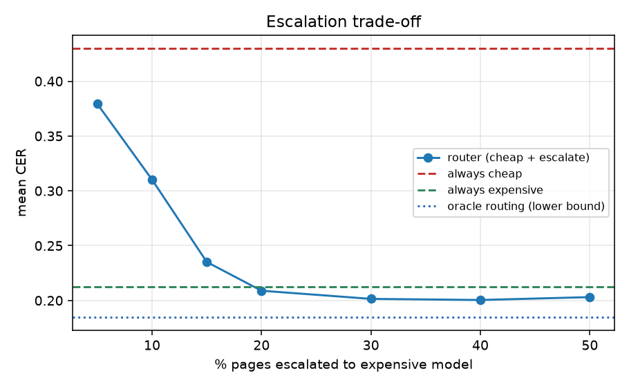

# Clinical OCR model bake-off — overnight results

Open-weights OCR / document-VLM evaluation on **real-artifact clinical scanned documents**, plus a routing study and a distillation experiment. All data is public or synthetic (no PHI).

_Generated 2026-09-15T06:13Z from `make_report.py`; 34 scored models, 14 experiment runs._

## TL;DR

- **Best accuracy: `qwen38-27b`** (mean CER 0.106, median 0.022).
- **Best value: `dots-mocr` (3B, MIT)** — CER 0.213 vs olmOCR-2's 0.208 at 1.4x the throughput.
- **Incumbent Tesseract**: mean CER 0.474, median 0.444 — the gap is worst on the degraded artifacts that dominate inbound faxes.
- **Router**: escalating only 20% of pages to Layout-class OCR reaches CER 0.209 at $0.00198/page (80% cheaper than escalating everything).
- **Distillation**: LoRA on synthetic degraded docs: overall CER 0.292 -> 0.278 (+0.014); handwriting +0.110; rotated +0.053
- **Distillation**: Teacher labels (olmOCR-2 output, no ground truth needed): 0.292 -> 0.254 (+0.038)
- **Distillation**: Teacher vs exact-GT labels: +0.025 CER — teacher labels match or beat exact ground truth, so unlabeled scans are enough to specialise a cheap student.
- **Distillation**: **But the two metrics disagree.** The teacher student is worse on field-level recall (0.731 vs 0.762; labelled MRN 0.596 vs 0.689). It reproduces the *page* better and the *identifiers* worse — it inherits the teacher's errors on exactly the tokens extraction depends on. By conclusion 5, that makes it the weaker candidate for production despite the better CER.
- **Teacher labels**: olmOCR-2 output matches exact ground truth at CER 0.062 (median 0.0016) on 800 synthetic degraded clinical docs — cheap to mint training labels for unlabeled scans.

## 1. Setup

**Data.** [`ClinOCR-Bench`](https://huggingface.co/datasets/Daniele0025/ClinOCR-Bench) (MIT): 328 eval documents across six artifact subsets — normal, handwriting, poor-quality, rotated, tables, mixed — built from 16 clinical templates (referral faxes, pathology reports, lab panels, discharge summaries) with real-world degradation and human-audited ground truth.

**Synthetic corpus for training.** 800 generated clinical documents with exact labels (263 handwriting-font), rendered and then degraded (rotation, perspective, blur, noise, low-DPI, JPEG, speckle, fold lines, vignette). Held-out evaluation stays on ClinOCR-Bench, which uses a different construction pipeline.

**Metric.** Character error rate (CER) after normalising markup and whitespace; plus field-level recall of dates, MRNs, accession codes, decimals and phone numbers (section 3).

**Hardware.** 2× RTX 4090 24 GB; vLLM v0.27.1 for served models; one model per GPU.

**Sample documents** (normal / handwriting / rotated / mixed):

| normal | handwriting | rotated | mixed |
|---|---|---|---|
|  |  |  |  |

## 2. Leaderboard

| model | params | license | mean CER | median CER | pages/s | normal | handwriting | poor | rotated | tables | mixed |
|---|---|---|---|---|---|---|---|---|---|---|---|
| qwen38-27b | 27B (FP8) | UNVERIFIED — confirm before any deployment decision | 0.1059 | 0.0224 | 0.26 | 0.022 | 0.046 | 0.025 | 0.034 | 0.071 | 0.492 |
| qwen25vl7b-lora-q38-hires | ? | ? | 0.1976 | 0.0375 | 0.46 | 0.025 | 0.064 | 0.067 | 0.241 | 0.061 | 0.816 |
| qwen25vl7b | 7B | Apache-2.0 | 0.1994 | 0.0513 | 0.54 | 0.026 | 0.103 | 0.076 | 0.265 | 0.071 | 0.732 |
| olmocr-2 | 8B | Apache-2.0 | 0.2076 | 0.0796 | 0.48 | 0.067 | 0.103 | 0.112 | 0.196 | 0.081 | 0.767 |
| qwen25vl7b-reppen | ? | ? | 0.2105 | 0.0513 | 0.52 | 0.030 | 0.100 | 0.076 | 0.282 | 0.071 | 0.787 |
| qwen25vl7b-base-m | ? | ? | 0.2112 | 0.0720 | 0.75 | 0.037 | 0.135 | 0.035 | 0.305 | 0.081 | 0.751 |
| dots-mocr | 3B | MIT | 0.2126 | 0.0747 | 0.67 | 0.085 | 0.126 | 0.085 | 0.241 | 0.058 | 0.759 |
| dots-mocr-c4 | ? | ? | 0.2161 | 0.0746 | 0.53 | 0.084 | 0.116 | 0.086 | 0.246 | 0.058 | 0.788 |
| dots-mocr-c1 | ? | ? | 0.2209 | 0.0754 | 0.26 | 0.085 | 0.120 | 0.091 | 0.244 | 0.059 | 0.811 |
| dots-mocr-c16 | ? | ? | 0.2210 | 0.0747 | 0.77 | 0.086 | 0.124 | 0.086 | 0.246 | 0.058 | 0.810 |
| dots-mocr-promptocr | ? | ? | 0.2213 | 0.0675 | 0.65 | 0.082 | 0.119 | 0.088 | 0.244 | 0.045 | 0.837 |
| qwen25vl7b-lora-q38-m | ? | ? | 0.2345 | 0.0464 | 0.61 | 0.022 | 0.187 | 0.032 | 0.308 | 0.064 | 0.886 |
| qwen25vl3b-base-hires | ? | ? | 0.2461 | 0.0609 | 0.81 | 0.037 | 0.166 | 0.076 | 0.297 | 0.123 | 0.867 |
| qwen25vl3b-lora-vllm | ? | ? | 0.2474 | 0.0596 | 0.71 | 0.033 | 0.089 | 0.077 | 0.350 | 0.103 | 0.930 |
| qwen25vl3b-lora-teacher | 3B + LoRA (37M) | Apache-2.0 | 0.2536 | 0.0918 | 0.11 | 0.040 | 0.215 | 0.065 | 0.370 | 0.092 | 0.820 |
| qwen25vl3b-lora-q38-hires | ? | ? | 0.2542 | 0.0499 | 0.69 | 0.029 | 0.093 | 0.077 | 0.389 | 0.096 | 0.939 |
| qwen25vl3b-lora-teacher-hires | ? | ? | 0.2582 | 0.0616 | 0.67 | 0.035 | 0.096 | 0.085 | 0.345 | 0.077 | 1.021 |
| dots-ocr | 3B | MIT | 0.2613 | 0.0761 | 0.61 | 0.051 | 0.165 | 0.083 | 0.314 | 0.061 | 0.999 |
| qwen25vl3b-lora-olmocr-m | ? | ? | 0.2639 | 0.0918 | 1.01 | 0.040 | 0.178 | 0.066 | 0.379 | 0.083 | 0.933 |
| qwen25vl3b-lora-hires | ? | ? | 0.2720 | 0.0592 | 0.65 | 0.031 | 0.092 | 0.081 | 0.407 | 0.109 | 1.017 |
| qwen25vl3b-lora | 3B + LoRA (37M) | Apache-2.0 | 0.2783 | 0.1003 | 0.10 | 0.039 | 0.215 | 0.046 | 0.383 | 0.164 | 0.914 |
| qwen25vl3b-lora-vllm-matched | ? | ? | 0.2844 | 0.0944 | 0.90 | 0.037 | 0.291 | 0.044 | 0.392 | 0.164 | 0.859 |
| qwen25vl3b-lora-q38-m | ? | ? | 0.2912 | 0.0669 | 0.90 | 0.029 | 0.236 | 0.048 | 0.374 | 0.094 | 1.079 |
| qwen25vl3b-base | 3B | Apache-2.0 | 0.2919 | 0.0616 | 0.18 | 0.036 | 0.325 | 0.047 | 0.436 | 0.080 | 0.916 |
| qwen25vl3b-base-m | ? | ? | 0.2969 | 0.0649 | 1.06 | 0.037 | 0.317 | 0.048 | 0.447 | 0.079 | 0.947 |
| qwen25vl3b-lora-gt-m | ? | ? | 0.3072 | 0.0954 | 0.81 | 0.039 | 0.231 | 0.046 | 0.421 | 0.171 | 1.038 |
| paddleocr-vl | 0.9B | Apache-2.0 | 0.4298 | 0.1005 | 1.70 | 0.071 | 0.502 | 0.164 | 0.502 | 0.183 | 1.278 |
| paddleocr-vl-promptb | ? | ? | 0.4453 | 0.0949 | 1.69 | 0.066 | 0.418 | 0.167 | 0.588 | 0.184 | 1.385 |
| tesseract | n/a | Apache-2.0 | 0.4744 | 0.4440 | 1.41 | 0.081 | 0.533 | 0.531 | 0.665 | 0.237 | 0.853 |
| deepseek-ocr | 3B MoE | MIT | 0.7717 | 0.3007 | 0.88 | 0.153 | 0.765 | 0.053 | 1.835 | 0.447 | 1.477 |
| paddleocr-vl-pipeline | 0.9B + PP-DocLayoutV2 | Apache-2.0 | 0.8235 | 0.4455 | 0.27 | 0.453 | 0.304 | 0.409 | 0.521 | 2.000 | 1.326 |
| chandra-2 | 5B | OpenRAIL-M (research/personal/<$2M only) | 0.8641 | 0.7134 | 0.40 | 0.826 | 0.897 | 0.839 | 0.770 | 0.625 | 1.289 |
| granite-docling | 0.26B | Apache-2.0 | 0.8665 | 0.8710 | 1.11 | 0.261 | 1.460 | 0.503 | 1.422 | 0.503 | 1.081 |
| nanonets-ocr2-3b | 3B | Apache-2.0 | 1.8010 | 2.0000 | 0.21 | 1.786 | 1.550 | 1.850 | 1.744 | 1.976 | 1.916 |

> ⚠️ **Not a model-quality result:** `nanonets-ocr2-3b` produced degenerate output (a single repeated character) on effectively every document. That is an integration failure in this harness — wrong chat template or processor config — not evidence about the model. Its row is listed for completeness; do not cite it as a score.


## 3. Where models fail


**Field-level recall** — whether clinically load-bearing tokens survive (dates, MRNs/IDs, lab decimals, accession codes, phone numbers):

| model | all fields | dates | ids 5–8d | decimals | codes | phones | labeled MRN |
|---|---|---|---|---|---|---|---|
| qwen38-27b | 0.910 | 0.908 | 0.920 | 0.926 | 0.847 | 0.905 | 0.897 |
| chandra-2 | 0.859 | 0.850 | 0.873 | 0.881 | 0.812 | 0.858 | 0.830 |
| qwen25vl7b-lora-q38-hires | 0.846 | 0.839 | 0.836 | 0.887 | 0.790 | 0.852 | 0.798 |
| dots-mocr-c16 | 0.831 | 0.845 | 0.804 | 0.876 | 0.825 | 0.797 | 0.766 |
| dots-mocr-c4 | 0.829 | 0.841 | 0.804 | 0.876 | 0.825 | 0.797 | 0.763 |
| qwen25vl7b-reppen | 0.828 | 0.845 | 0.819 | 0.838 | 0.777 | 0.856 | 0.760 |
| qwen25vl7b | 0.828 | 0.831 | 0.824 | 0.844 | 0.786 | 0.856 | 0.769 |
| dots-mocr-c1 | 0.827 | 0.838 | 0.801 | 0.876 | 0.825 | 0.793 | 0.763 |
| dots-mocr | 0.827 | 0.838 | 0.806 | 0.873 | 0.808 | 0.799 | 0.766 |
| dots-mocr-promptocr | 0.827 | 0.837 | 0.800 | 0.877 | 0.812 | 0.801 | 0.756 |
| dots-ocr | 0.826 | 0.835 | 0.800 | 0.881 | 0.764 | 0.811 | 0.763 |
| qwen25vl7b-lora-q38-m | 0.823 | 0.815 | 0.831 | 0.872 | 0.729 | 0.799 | 0.792 |
| qwen25vl3b-lora-vllm | 0.812 | 0.813 | 0.793 | 0.868 | 0.677 | 0.826 | 0.766 |
| qwen25vl7b-base-m | 0.806 | 0.811 | 0.803 | 0.862 | 0.712 | 0.771 | 0.756 |
| qwen25vl3b-lora-hires | 0.805 | 0.808 | 0.783 | 0.856 | 0.699 | 0.811 | 0.766 |
| qwen25vl3b-base-hires | 0.801 | 0.806 | 0.813 | 0.840 | 0.594 | 0.813 | 0.779 |
| qwen25vl3b-lora-q38-hires | 0.801 | 0.806 | 0.790 | 0.846 | 0.642 | 0.832 | 0.747 |
| olmocr-2 | 0.785 | 0.812 | 0.721 | 0.886 | 0.742 | 0.742 | 0.644 |
| qwen25vl3b-lora-teacher-hires | 0.782 | 0.790 | 0.743 | 0.838 | 0.751 | 0.783 | 0.696 |
| qwen25vl3b-base-m | 0.765 | 0.757 | 0.757 | 0.840 | 0.672 | 0.738 | 0.692 |
| qwen25vl3b-lora-gt-m | 0.764 | 0.764 | 0.730 | 0.857 | 0.707 | 0.710 | 0.699 |
| qwen25vl3b-lora-q38-m | 0.764 | 0.768 | 0.731 | 0.857 | 0.686 | 0.726 | 0.670 |
| qwen25vl3b-lora | 0.762 | 0.765 | 0.726 | 0.857 | 0.703 | 0.708 | 0.689 |
| qwen25vl3b-lora-vllm-matched | 0.760 | 0.763 | 0.726 | 0.859 | 0.677 | 0.706 | 0.689 |
| qwen25vl3b-base | 0.760 | 0.755 | 0.744 | 0.840 | 0.659 | 0.744 | 0.673 |
| paddleocr-vl | 0.754 | 0.715 | 0.806 | 0.775 | 0.703 | 0.750 | 0.737 |
| qwen25vl3b-lora-olmocr-m | 0.734 | 0.740 | 0.669 | 0.842 | 0.690 | 0.724 | 0.590 |
| paddleocr-vl-promptb | 0.733 | 0.714 | 0.780 | 0.729 | 0.677 | 0.728 | 0.747 |
| qwen25vl3b-lora-teacher | 0.731 | 0.739 | 0.676 | 0.825 | 0.686 | 0.724 | 0.596 |
| paddleocr-vl-pipeline | 0.676 | 0.683 | 0.580 | 0.849 | 0.638 | 0.661 | 0.413 |
| deepseek-ocr | 0.606 | 0.588 | 0.557 | 0.742 | 0.502 | 0.590 | 0.471 |
| tesseract | 0.538 | 0.577 | 0.523 | 0.561 | 0.489 | 0.501 | 0.481 |
| granite-docling | 0.308 | 0.287 | 0.460 | 0.113 | 0.367 | 0.432 | 0.372 |
| nanonets-ocr2-3b | 0.000 | 0.000 | 0.000 | 0.000 | 0.000 | 0.000 | 0.000 |

## 4. Throughput & cost

| model | pages/s (1 GPU, c=8) | pages/day (1 GPU) | electricity/day | Azure Layout/day | saving |
|---|---|---|---|---|---|
| paddleocr-vl | 1.70 | 146,534 | $1.62 | $1,465 | 905x |
| paddleocr-vl-promptb | 1.69 | 146,189 | $1.62 | $1,462 | 902x |
| granite-docling | 1.11 | 96,336 | $1.62 | $963 | 595x |
| qwen25vl3b-base-m | 1.06 | 91,757 | $1.62 | $918 | 566x |
| qwen25vl3b-lora-olmocr-m | 1.01 | 87,178 | $1.62 | $872 | 538x |
| qwen25vl3b-lora-q38-m | 0.90 | 77,846 | $1.62 | $778 | 481x |
| qwen25vl3b-lora-vllm-matched | 0.90 | 77,674 | $1.62 | $777 | 479x |
| deepseek-ocr | 0.88 | 76,118 | $1.62 | $761 | 470x |
| qwen25vl3b-base-hires | 0.81 | 70,416 | $1.62 | $704 | 435x |
| qwen25vl3b-lora-gt-m | 0.81 | 69,811 | $1.62 | $698 | 431x |
| dots-mocr-c16 | 0.77 | 66,096 | $1.62 | $661 | 408x |
| qwen25vl7b-base-m | 0.75 | 64,714 | $1.62 | $647 | 399x |
| qwen25vl3b-lora-vllm | 0.71 | 61,344 | $1.62 | $613 | 379x |
| qwen25vl3b-lora-q38-hires | 0.69 | 59,616 | $1.62 | $596 | 368x |
| qwen25vl3b-lora-teacher-hires | 0.67 | 57,888 | $1.62 | $579 | 357x |
| dots-mocr | 0.67 | 57,542 | $1.62 | $575 | 355x |
| dots-mocr-promptocr | 0.65 | 56,246 | $1.62 | $562 | 347x |
| qwen25vl3b-lora-hires | 0.65 | 56,246 | $1.62 | $562 | 347x |
| qwen25vl7b-lora-q38-m | 0.61 | 52,531 | $1.62 | $525 | 324x |
| dots-ocr | 0.61 | 52,445 | $1.62 | $524 | 324x |
| qwen25vl7b | 0.54 | 46,483 | $1.62 | $465 | 287x |
| dots-mocr-c4 | 0.53 | 45,965 | $1.62 | $460 | 284x |
| qwen25vl7b-reppen | 0.52 | 44,496 | $1.62 | $445 | 275x |
| olmocr-2 | 0.48 | 41,213 | $1.62 | $412 | 254x |
| qwen25vl7b-lora-q38-hires | 0.46 | 39,917 | $1.62 | $399 | 246x |
| chandra-2 | 0.40 | 34,646 | $1.62 | $346 | 214x |
| paddleocr-vl-pipeline | 0.27 | 23,414 | $1.62 | $234 | 145x |
| qwen38-27b | 0.26 | 22,810 | $1.62 | $228 | 141x |
| dots-mocr-c1 | 0.26 | 22,550 | $1.62 | $226 | 139x |
| nanonets-ocr2-3b | 0.21 | 18,317 | $1.62 | $183 | 113x |
| qwen25vl3b-base | 0.18 | 15,898 | $1.62 | $159 | 98x |
| qwen25vl3b-lora-teacher | 0.11 | 9,418 | $1.62 | $94 | 58x |
| qwen25vl3b-lora | 0.10 | 8,899 | $1.62 | $89 | 55x |

Assumes one 450 W 4090 at $0.15/kWh (~$1.62/day); Azure Layout OCR at $0.01/page. Self-hosting is 3–4 orders of magnitude cheaper per page *before* counting GPU amortisation.*

## 5. Router: cheap model + escalate the hard tail

Cheap model = **paddleocr-vl**, escalate to **dots-mocr** (proxy for Azure Layout at $0.01/page).

| escalation budget | blended CER | cost/page | cost / 1M pages | failures caught |
|---|---|---|---|---|
| 5% | 0.3792 | $0.00049 | $488 | 16/97 |
| 10% | 0.3102 | $0.00098 | $976 | 32/97 |
| 15% | 0.2351 | $0.00149 | $1,494 | 49/97 |
| 20% | 0.2089 | $0.00198 | $1,982 | 61/97 |
| 30% | 0.2014 | $0.00299 | $2,988 | 74/97 |
| 40% | 0.2004 | $0.00399 | $3,994 | 82/97 |
| 50% | 0.2030 | $0.00500 | $5,000 | 83/97 |
| oracle | 0.1849 | $0.00296 | $2,957 | 97/97 |

| classifier | AUC | accuracy | precision | recall |
|---|---|---|---|---|
| logreg | 0.865 | 0.823 | 0.714 | 0.670 |
| gboost | 0.887 | 0.884 | 0.904 | 0.680 |

Failure rate by subset (cheap model): **mixed** 85%, **handwriting** 41%, **rotated** 41%, **tables** 7%, **normal** 5%, **poor** 5%

Top predictive features: `pred_len` 0.66, `skewness` 0.07, `height` 0.05, `ink` 0.05, `avg_tok_len` 0.03, `blockiness` 0.02



**Other cheap -> expensive pairings** (20% escalation budget):

| pair | always cheap | always expensive | router CER | cost/page | AUC |
|---|---|---|---|---|---|
| dots-mocr -> olmocr-2 | 0.213 | 0.208 | 0.191 | $0.00198 | 0.911 |
| paddleocr-vl -> olmocr-2 | 0.430 | 0.208 | 0.206 | $0.00198 | 0.887 |

## 6. Distillation: can a cheap model learn the hard cases?

| student | mean CER | median CER | normal | handwriting | poor | rotated | tables | mixed |
|---|---|---|---|---|---|---|---|---|
| base Qwen2.5-VL-3B | 0.2919 | 0.0616 | 0.036 | 0.325 | 0.047 | 0.436 | 0.080 | 0.916 |
| + LoRA (exact GT labels) | 0.2783 | 0.1003 | 0.039 | 0.215 | 0.046 | 0.383 | 0.164 | 0.914 |
| + LoRA (teacher labels) | 0.2536 | 0.0918 | 0.040 | 0.215 | 0.065 | 0.370 | 0.092 | 0.820 |

- LoRA on synthetic degraded docs: overall CER 0.292 -> 0.278 (+0.014); handwriting +0.110; rotated +0.053
- Teacher labels (olmOCR-2 output, no ground truth needed): 0.292 -> 0.254 (+0.038)
- Teacher vs exact-GT labels: +0.025 CER — teacher labels match or beat exact ground truth, so unlabeled scans are enough to specialise a cheap student.
- **But the two metrics disagree.** The teacher student is worse on field-level recall (0.731 vs 0.762; labelled MRN 0.596 vs 0.689). It reproduces the *page* better and the *identifiers* worse — it inherits the teacher's errors on exactly the tokens extraction depends on. By conclusion 5, that makes it the weaker candidate for production despite the better CER.


## 7. Teacher label quality

| teacher | docs | CER vs exact GT | median | printed text | handwriting font | pages/s |
|---|---|---|---|---|---|---|
| olmOCR-2-7B | 800 | 0.0621 | 0.0016 | 0.0561 | 0.0742 | 0.86 |

## 8. Run log

| experiment | exit | minutes |
|---|---|---|
| e01_paddle_pipeline | ok | 21.6 |
| e02_train_lora | ok | ? |
| e03_eval_students | ok | 53.5 |
| e04_models_a | ok | 16.4 |
| e05_models_b | ok | 30.0 |
| e06_models_c | ok | 8.7 |
| e07_prompt_variants | ok | 9.9 |
| e08_concurrency | ok | 42.9 |
| e10_field_fidelity | rc=1 | 0.0 |
| e11_router | ok | 0.1 |
| e12_analysis | rc=1 | ? |
| e13_distill_teacher | rc=124 | 60.0 |
| e14_router_v2 | ok | 0.3 |
| e99_restore_service | ok | 0.5 |

## 9. Conclusions

1. **Replace Tesseract for degraded scans.** Every VLM tested beats it on the artifacts that dominate inbound faxes; the median-doc gap is ~6x.
2. **`dots-mocr` (3B, MIT) is the best default**: accuracy equal to the 8B olmOCR-2 at much higher throughput and a permissive licence.
3. **Routing is the real cost lever**: a classifier over cheap image + transcript features catches the failures, so you pay Layout prices on a small slice instead of every page.
4. **Distillation works, but pick the label source on field recall, not CER**: see section 6. Teacher labels minted by olmOCR-2 over unlabeled scans win on CER (0.254 vs 0.278 for hand-exact labels; base 0.292), because exact labels are flat text and regress `tables` (0.080 -> 0.164) while the teacher emits markdown that survives (0.092). But the teacher student is *worse* on field recall (0.731 vs 0.762; labelled MRN 0.596 vs 0.689) — it inherits the teacher's errors on the identifiers extraction depends on. Teacher labels take ground truth off the critical path; they do not yet clear conclusion 5.
5. **Field-level fidelity, not CER, should gate production**: see section 3.


## Appendix: reproduce

```bash
bash setup_env.sh          # venv + deps + tesseract
python3 export_data.py     # pull ClinOCR-Bench test split
python3 gen_synth.py --n 800 --out data/synth
bash run_model.sh <name> <hf_id> <gpu> "<prompt>"
bash overnight.sh          # full experiment queue + report + push
```
